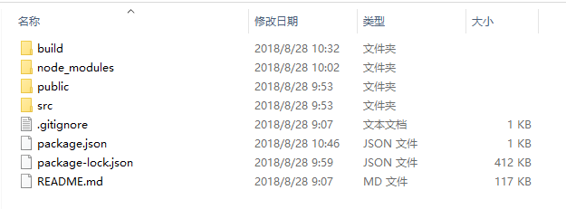
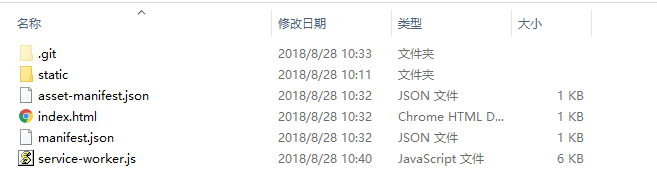

## 深入浅之 React 框架
+ ### 什么是 React 
    >React 用来构建UI的 JavaScript库,而不是一个 MVC 框架，仅仅是视图（V）层的库

* ### 基本原理
    当你使用React的时候，在某个时间点 render() 函数创建了一棵React元素树，在下一个state或者props更新的时候，render() 函数将创建一棵新的React元素树，React将对比这两棵树的不同之处，计算出如何高效的更新UI（只更新变化的地方）。

   -  ##### 特点:
      1. 使用 JSX语法 创建组件，实现组件化开发
      2. 性能高，通过 diff算法 和 虚拟DOM 实现视图的高效更新
      3. 技术成熟，社区完善，配件齐全，适用于大型Web项目（生态系统健全）
      4. 使用方式简单，性能非常高，支持服务端渲染
  
    - ##### 官方参考文档
        [React 官网](https://facebook.github.io/react)
        [React 中文文档](https://doc.react-china.org)

+ ### React 安装
    - #### 直接引 js 入文件
      
        1. ##### 直接去官网下载并引入这三个库： react.min.js 、react-dom.min.js 和 babel.min.js
        
            `react.min.js` - React 的核心库
            `react-dom.min.js` - 提供与 DOM 相关的功能
            `babel.min.js`  - Babel 可以将 ES6 代码转为 ES5 代码，这样我们就能在目前不支持 ES6 浏览器上执行 React 代码。Babel 内嵌了对 JSX 的支持。通过将 Babel 和 babel-sublime 包（package）一同使用可以让源码的语法渲染上升到一个全新的水平。
            ##### 注意：
            ```js
            如果需要使用 JSX，则 <script> 标签的 type 属性需要设置为 text/babel。
            ```

        2. ##### 也可以直接使用 BootCDN 的 React CDN 库：
            ```js
            <script src="https://cdn.bootcss.com/react/16.4.0/umd/react.development.js"></script>
            <script src="https://cdn.bootcss.com/react-dom/16.4.0/umd/react-dom.development.js"></script>
            <!-- 生产环境中不建议使用 -->
            <script src="https://cdn.bootcss.com/babel-standalone/6.26.0/babel.min.js"></script>
            ```
        3. ##### 官方提供的 CDN 地址：
            ```js
            <script src="https://unpkg.com/react@16/umd/react.development.js"></script>
            <script src="https://unpkg.com/react-dom@16/umd/react-dom.development.js"></script>
            <!-- 生产环境中不建议使用 -->
            <script src="https://unpkg.com/babel-standalone@6.15.0/babel.min.js"></script>
            ```
    - #### 通过 npm 安装 React
        国内使用 npm 速度很慢，你可以使用淘宝定制的 cnpm (gzip 压缩支持) 命令行工具代替默认的 npm:
        ```js
        $ npm install -g cnpm --registry=https://registry.npm.taobao.org

        $ npm config set registry https://registry.npm.taobao.org
        ```
        这样就可以使用 cnpm 命令来安装模块了：
        ```js
        $ cnpm install [name]
        ```
    - #### 使用 create-react-app 快速构建 React 开发环境

        `create-react-app` 是来自于 Facebook，通过该命令我们无需配置就能快速构建 React 开发环境。

        `create-react-app` 自动创建的项目是基于 Webpack + ES6 。

      #####  执行以下命令创建项目：
        ```js
        $ cnpm install -g create-react-app  //安装　create-react-app 
        $ create-react-app my-app　　　　　　　//使用 create-react-app 创建 my-app 项目
        $ cd my-app/                         //进入创建的文件夹
        $ npm start                          //跑起项目
        ```
+ ### 模块的导入和导出
    - #### 模块导出方式
        ```js
        const a = 10
        const b = 20

        // 1.命名导出 可以使用多次
        export { a, b }
        export { b }
        export const c = 30

        // 2.默认导出 只能使用一次可以和命名导出同时使用
        export default a
        ```
    - #### 模块导入方式 
        ```js
        //1.命名导入  导入的变量名必须和导出的相同
        // a as c 相当于导入 a 改名成 c
        import {a as c,b} from './test'
        import {b} from './test'

        //2.默认导入  导入的变量名随意
        import xxx from './test'
        import {c} from './test'
        import xxx,{c} from './test'
        ```
    + #### 第三方模块和核心模块导入方式
        使用npm下载的第三方模块，但是由于 `require` 是属于 `node` 的方法，浏览器不支持所以我们先使用 node 命令运行js文件看效果。以后我们会用 webpack 工具帮助我们搭建开发环境编译 node 方法使其让浏览器支持。`require` 方法是去第三方模块内的 package.json 下声明的入口文件找某个js文件。

        ##### 使用 `module.exports` 导出，`require('路径')` 导入。
        ```js
        var $ = require('jquery')  //导入
        var a = 10
        var b = 20
        var add = function(a, b) {
            return a + b
        }
        module.exports = add       //导出
        ```
+ ### React State(状态)
    >React 把组件看成是一个状态机（State Machines）。通过与用户的交互，实现不同状态，然后渲染 UI，让用户界面和数据保持一致。只需更新组件的 state，然后根据新的 state 重新渲染用户界面（不要操作 DOM）。

    * ##### 作用：
        用来给组件提供组件内部使用的数据
        
    * ##### 注意：
        1. 只有通过class创建的组件才具有状态
        2. 状态是私有的，完全由组件来控制
        3. 不要在 state 中添加 render() 方法中不需要的数据，会影响渲染性能！
        4. 可以将组件内部使用但是不渲染在视图中的内容，直接添加给 this
        5. 不要在 render() 方法中调用 setState() 方法来修改state的值，但是可以通过 this.state.name = 'rose' 方式设置state（不推荐!!!!）

    * ##### 书写 state 两种方式如下：
        ```js
        constructor(props) {
            super(props);
            this.state = {
                key: value,
                ...
                ...
                ...
            };
        }

        //简写方式:

        state = {
            key: value,
                ...
                ...
                ...
        };
        ```
    * ##### 修改 `state`，组件并不会重新重发 `render`。例如：
        ```js
        this.setState({title: 'React'});
        ```
    * ##### 获取 `state`。例如：
        ```js
        const {key}=this.state
        //或者
        const key = this.state.key;
        ```

+ ### React Props

    - state 和 props 主要的区别在于 props 是不可变的，而 state 可以根据与用户交互来改变。这就是为什么有些容器组件需要定义 state 来更新和修改数据。 而子组件只能通过 props 来传递数据。

    - ##### 作用：
        给组件传递数据，一般用在父子组件之间
    - ##### 说明：
        React 把传递给组件的属性转化为一个对象并交给 props
    - ##### 特点：
        props 是只读的，无法给props添加或修改属性
        props.children：获取组件的内容，比如：`<Hello>组件内容</Hello> 中的 组件内容`


- ### 使用PropTypes进行类型检查
    >React.PropTypes 在 React v15.5 版本后已经移到了 prop-types 库。Props 验证使用 propTypes，它可以保证我们的应用组件被正确使用，React.PropTypes 提供很多验证器 (validator) 来验证传入数据是否有效。当向 props 传入无效数据时，JavaScript 控制台会抛出警告。
    ```js
    <script src="https://cdn.bootcss.com/prop-types/15.6.1/prop-types.js"></script>
    ```
    + #### PropTypes 验证器的示例
    ```js
    import PropTypes from 'prop-types';

        MyComponent.propTypes = {
        // 您可以声明一个道具是一个特定的JS类型。默认情况下，这些都是可选的。
        optionalArray: PropTypes.array,
        optionalBool: PropTypes.bool,
        optionalFunc: PropTypes.func,
        optionalNumber: PropTypes.number,
        optionalObject: PropTypes.object,
        optionalString: PropTypes.string,
        optionalSymbol: PropTypes.symbol,

        // 可以呈现的任何东西：包含这些类型的数字、字符串、元素或数组（或片段）。
        optionalNode: PropTypes.node,

        // 反应元件
        optionalElement: PropTypes.element,

        // 您还可以声明一个PROP是一个类的实例。这使用JS的实例操作符。
        optionalMessage: PropTypes.instanceOf(Message),

        // 您可以通过将其视为枚举来确保您的道具仅限于特定值。
        optionalEnum: PropTypes.oneOf(['News', 'Photos']),

        // 可以是多种类型之一的对象
        optionalUnion: PropTypes.oneOfType([
            PropTypes.string,
            PropTypes.number,
            PropTypes.instanceOf(Message)
        ]),

        // 某种类型的数组
        optionalArrayOf: PropTypes.arrayOf(PropTypes.number),

        // 具有某种类型的属性值的对象
        optionalObjectOf: PropTypes.objectOf(PropTypes.number),

        //具有特定形状的物体
        optionalObjectWithShape: PropTypes.shape({
            color: PropTypes.string,
            fontSize: PropTypes.number
        }),

        // 如果没有提供道具，您可以将上面的任何一个链接为“Is必需品”，以确保显示出警告。
        requiredFunc: PropTypes.func.isRequired,

        // 一个数据类型值
        requiredAny: PropTypes.any.isRequired,

        // 还可以指定自定义验证器。如果验证失败，它应该返回一个错误对象。不要“控制台，警告”或“扔”，因为这不能在“OfFoType”中工作。
        customProp: function(props, propName, componentName) {
            if (!/matchme/.test(props[propName])) {
            return new Error(
                'Invalid prop `' + propName + '` supplied to' +
                ' `' + componentName + '`. Validation failed.'
            );
            }
        },

        // 您还可以为“ARALYOF”和“Objutof”提供自定义验证器。如果验证失败，它应该返回一个错误对象。将为数组或对象中的每个键调用验证器。验证器的前两个参数是数组或对象本身，以及当前项的密钥。
        customArrayProp: PropTypes.arrayOf(function(propValue, key, componentName, location, propFullName) {
            if (!/matchme/.test(propValue[key])) {
            return new Error(
                'Invalid prop `' + propFullName + '` supplied to' +
                ' `' + componentName + '`. Validation failed.'
            );
            }
        })
    };
    ```
    + #### 实例
    ```js
    import PropTypes from 'prop-types';

        class Greeting extends React.Component {
            render() {
                return (
                    <h1>Hello, {this.props.name}</h1>
                );
            }
        }

    Greeting.propTypes = {
        name: PropTypes.string
    };
    ```

+ ### 组件的生命周期
    1. ##### 简单说：一个组件从开始到最后消亡所经历的各种状态，就是一个组件的生命周期
    2. ##### 组件生命周期函数的定义：从组件被创建，到组件挂载到页面上运行，再到页面关
    3. 闭组件被卸载，这三个阶段总是伴随着组件各种各样的事件，那么这些事件，统称为组件的生命周期函数。


        ##### 组件的生命周期包含三个阶段：`创建阶段（Mounting）`、`运行和交互阶段（Updating）`、`卸载阶段（Unmounting）`


    + #### 创建阶段（Mounting）
        ```js
        constructor() 
        componentWillMount() 
        render() 
        componentDidMount()
        ```
    + #### 运行和交互阶段（Updating）
        ```js
        componentWillReceiveProps() 
        shouldComponentUpdate() 
        componentWillUpdate() 
        render() 
        componentDidUpdate()
        ```
    + #### 卸载阶段（Unmounting）
        ```js
        componentWillUnmount()
        ```

    + #### 创建阶段(Mounting)

        特点：该阶段的函数只执行一次
        * ##### constructor()
            作用：1 获取props 2 初始化state
            说明：通过 constructor() 的参数props获取

        * ##### componentWillMount()
            说明：组件被挂载到页面之前调用，其在render()之前被调用，因此在这方法里同步地设置状态将不会触发重渲染
            注意：无法获取页面中的DOM对象
            注意：可以调用 setState() 方法来改变状态值
            用途：发送ajax请求获取数据

        * ##### render()
            作用：渲染组件到页面中，无法获取页面中的DOM对象
            注意：不要在render方法中调用 setState() 方法，否则会递归渲染

            原因说明：状态改变会重新调用render()，render()又重新改变状态

        * ##### componentDidMount()
            1 组件已经挂载到页面中
            2 可以进行DOM操作，比如：获取到组件内部的DOM对象
            3 可以发送请求获取数据
            4 可以通过 setState() 修改状态的值
            注意：在这里修改状态会重新渲染

    + #### 运行阶段（Updating）
        特点：该阶段的函数执行多次
        说明：每当组件的props或者state改变的时候，都会触发运行阶段的函数
        + ##### componentWillReceiveProps()
            说明：组件接受到新的props前触发这个方法
            参数：当前组件props值
            可以通过 this.props 获取到上一次的值
            使用：若你需要响应属性的改变，可以通过对比this.props和nextProps并在该方法中使用this.setState()处理状态改变
            注意：修改state不会触发该方法

        + ##### shouldComponentUpdate()
            作用：根据这个方法的返回值决定是否重新渲染组件，返回true重新渲染，否则不渲染
            优势：通过某个条件渲染组件，降低组件渲染频率，提升组件性能
            说明：如果返回值为false，那么，后续render()方法不会被调用
            注意：这个方法必须返回布尔值！！！
            场景：根据随机数决定是否渲染组件

        + ##### componentWillUpdate()
            作用：组件将要更新
            参数：最新的属性和状态对象
            注意：不能修改状态 否则会循环渲染

        + ##### render() 渲染
            作用：重新渲染组件，与Mounting阶段的render是同一个函数
            注意：这个函数能够执行多次，只要组件的属性或状态改变了，这个方法就会重新执行
        + ##### componentDidUpdate()
            作用：组件已经被更新
            参数：旧的属性和状态对象

    + #### 卸载阶段（Unmounting）
        + 组件销毁阶段：组件卸载期间，函数比较单一，只有一个函数，这个函数也有一个显著的特点：组件一辈子只能执行依次！
        + 使用说明：只要组件不再被渲染到页面中，那么这个方法就会被调用（ 渲染到页面中 -> 不再渲染到页面中 ）
    + #### componentWillUnmount()
        + 作用：在卸载组件的时候，执行清理工作，比如


+ ### 生命周期案例
    ```js
        import React, { Component } from 'react'

        class Test extends Component {
        constructor() {
            super()
            this.state = {
            text: 1
            }
            console.log('生命周期函数----- constructor --- 初始化state')
        }
        static getDerivedStateFromProps(nextProps, prevState) {
            // 必须返回一个 state
            // 实例化组件的时候 和  当组件接收新的 props 时 该生命周期函数被执行
            console.log('生命周期函数----- static getDerivedStateFromProps')
            return null
        }
        shouldComponentUpdate() {
            // 该函数必须返回一个布尔值 来控制是否更新
            console.log('生命周期函数----- shouldComponentUpdate 是否同意组件更新')
            return true
        }
        handleClick = () => {
            this.setState({
            text: this.state.text + 1
            })
        }
        render() {
            console.log('生命周期函数----- render 渲染到页面')
            return (
            <div>
                <button onClick={this.handleClick}>+</button>
                <span>{this.state.text}</span>
            </div>
            )
        }
        componentDidMount() {
            // 这个生命周期函数内 允许发送网络请求修改 state
            console.log('生命周期函数----- componentDidMount  组件装配完毕')
        }
        // 自定义代码片段
        componentDidUpdate() {
            console.log('生命周期函数----- componentDidUpdate  组件更新完毕')
        }
        }

        export default Test
    ```


- ### 受控组件

    受控组件在HTML当中，像`input`,`textarea`和`select`这类表单元素会维持自身状态，并根据用户输入进行更新。
    在React中，可变的状态通常保存在组件的state中，并且只能用 `setState()` 方法进行更新. React根据初始状态渲染表单组件，接受用户后续输入，改变表单组件内部的状态。因此，将那些值由React控制的表单元素称为：受控组件。
    简单来说，页面中输入内容的变化必须使用 `state` 控制，使用 `onChange` 事件修改 `state` ，`onChange` 只要输入框内容发生改变就会被触发。案例：
    ```js
    class Demo extends Component {
    state = {
        value:'';
    }
    
    handleChange(e) {
        //修改 state
        this.setState({
            value: e.target.value
        })
    }

    render() {
        const {value}= this.state
        return (
            //输入
            <input value={this.state.value} onChange={e => this.handleChange(e)}/>
            //输出
            <div>{value}</div>
        )
    }
}
    ```

- ### 非受控组件　
    非受控组件:页面中输入内容的变化不受 state 控制 
    ```js
        <label htmlFor="username">用户名</label>
        <input id="username" type="text" defaultValue="默认" />
    ```

- ### React 补充内容
    - #### key 属性
        React提供了一个 key 属性。当子节点带有key属性，React会通过key来匹配原始树和后来的树。
        - ##### 说明：
            key属性在React内部使用，但不会传递给你的组件
        - ##### 推荐：
            在遍历数据时，推荐在组件中使用 key 属性
            ```js 
            <li key={item.id}>{item.name}</li>
            ```
        - ##### 注意：
            key只需要保持与他的兄弟节点唯一即可，不需要全局唯一,尽可能的减少数组index作为key，数组中插入元素的等操作时，会使得效率底下

    - #### JSX 的基本使用
        - ##### JSX语法，最终会被编译为 `createElement()` 方法，推荐，使用 JSX 的方式创建组件
        - ##### JSX - JavaScript XML
            - ##### 安装：
                ```js
                npm i -D babel-preset-react （依赖与：babel-core/babel-loader）
                ```
            - ##### 注意点
                1. JSX的语法需要通过 `babel-preset-react` 编译后，才能被解析执行
                2. 如果在 JSX 中给元素添加类, 需要使用 `className 代替 class`
                3. label 的 `for` 属性，使用 `htmlFor代` 替
                4. 在 JSX 中可以直接使用 JS代码，直接在 JSX 中通过 `{}` 中间写 JS代码即可
                5. 在 JSX 中只能使用表达式，但是不能出现 语句！！！
                6. 在 JSX 中注释语法：`{/* 中间是注释的内容 */}`


    - #### react 包作用: 
        允许 js 内填写 html 语法，我们将这种语法叫做 jsx 语法
        
    - #### react-dom 包作用: 
        ReactDOM.render方法 将 App 渲染都 root下, 将虚拟的 react dom 节点渲染到真实的 dom 节点上


+ ### 将 `react` 项目部署到 `github` 的 `gh-pages` 分支
    - #### 方案一
        + 第一步 
            验证我们的项目能否在 `React` 搭建的环境下正常运行，如果可以，则执行下面的第二步，否则修改项目代码。

        - 第二步
            需要在项目的 `package.json` 中的 `script` 字段下添加如下代码：
            ```js
                "predeploy": "npm run build", 
                "deploy": "gh-pages -d build"
            ```
        + 第三步

            在我们自己的 GitHub 上新建仓库，然后将我们的项目 `git push` 到我们的新建的仓库下，之后在本地新建 `gh-pages` 分支 , 然后切换到 `gh-pages` 分支，执行 `npm run build` 然后将里面的所有内容删除 只留下 `.git` 、`.gitignore` 和 `build` 文件夹下的所有内容(不需要 build 文件夹)
            删除之前仓库内部内容如下:
            
            删除之后仓库内部内容如下:
            
        + 第四步
            然后 `git` 三步 更新 `gh-pages`
            ```js
            git add .
            git commit -m'describe'
            git push origin gh-pages
            ```
        + 第五步

            打开浏览器，在地址栏输入： [https://zllugithub.github.io/react-cat-dom](https://zllugithub.github.io/react-cat-dom/) 就可以访问上传的项目了。

        + 附加

            如果 `homepage` 填写错误，想要更改的话，需要先到 `mster` 分支更新 `package.json` 的 `homepage`，然后执行 `npm run build` 将 `build` 内的 文件拷贝，再然后切换到 `gh-page`s 分支，将拷贝的内容粘贴到这里。最后更新 `gh-pages` 分支。

    - #### 方案二

        - 第一步
            在方案一的第二步完成的基础上，在项目下，安装 `gh-pages` 包 , 命令如下：
            ```js
            npm i -D gh-pages
            ```
            
            安装完 `gh-pages` 之后在 `package.json` 中的 `script` 字段下添加如下内容：
            ```js
            "predeploy": "npm run build", 
            "deploy": "gh-pages -d build"
            ```
        + 第二步

            在我们自己的 GitHub 上新建仓库，然后将我们的项目 `git push` 到我们的新建的仓库下，之后在本地新建 `gh-pages` 分支 , 然后切换到 `gh-pages` 分支，执行 `npm run build` 然后将里面的所有内容删除 只留下 `.git` 、`.gitignore` 和 `build` 文件夹下的所有内容(不需要 build 文件夹)
            删除之前仓库内部内容如下:
            
            删除之后仓库内部内容如下:
            

            网上新建仓库将我们的项目传到网上，然后执行:
            ```js
            npm run deploy
            ```
        + 第三步
            然后 `git` 三步 更新 `gh-pages`
            ```js
            git add .
            git commit -m'describe'
            git push origin gh-pages
            ```
        + 第四步

            打开浏览器，在地址栏输入： [https://zllugithub.github.io/react-cat-dom](https://zllugithub.github.io/react-cat-dom/) 就可以访问上传的项目了。

+ ### 将 react 项目部署到 netlify 免费服务器
    + 将我们的项目上传到 `github` 仓库

    + 到 `netlify` 网站上点击 `New sit from Git`，选择 GItHub，点击你要部署的仓库名

    + `Branch to Deploy` 选择 `master` 分支，`Build command` 填写 `npm run build` , `Publish directory` 填写 `build/`
    
    + 最后点击 `Deploy site` ，在弹出的页面等待几分钟就部署成功了。

    + ###### 注意:
        该方案 `package.json` 下不需要添加 `homepage` 字段。
+ ### React package.js 配置
    ```js
    {
        "name": "React",
        "version": "0.1.0",
        "private": true,
        "dependencies": {
            "axios": "^0.18.0",
            "draft-js": "^0.10.5",
            "draftjs-to-html": "^0.8.4",
            "draftjs-to-markdown": "^0.5.1",
            "moment": "^2.22.2",
            "react": "^16.4.2",
            "react-dom": "^16.4.2",
            "react-draft-wysiwyg": "^1.12.13",
            "react-moment": "^0.7.9",
            "react-redux": "^5.0.7",
            "react-router-dom": "^4.3.1",
            "react-scripts": "1.1.5",
            "redux": "^4.0.0",
            "redux-logger": "^3.0.6",
            "redux-thunk": "^2.3.0",
            "styled-components": "^3.4.5"
        },
        "scripts": {
            "start": "react-scripts start",
            "build": "react-scripts build",
            "test": "react-scripts test --env=jsdom",
            "eject": "react-scripts eject"
        }
    }

    ```